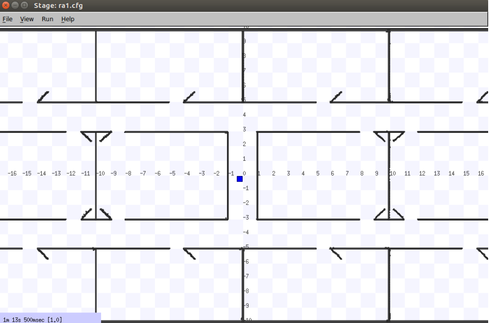

# Task 2: Stage Mobile Robot Simulator

## Task 2.1


```
rosrun stage_ros stageros ra1.cfg
```




```
rosbag record -a
```


## Task 2.2

```
rosrun teleop_twist_keyboard teleop_twist_keyboard.py
```

